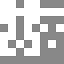

# DualGrid 16

Class: `PentaTileLayoutDualGrid16`

DualGrid 16 uses a 4x4 atlas with one authored tile for each 4-bit corner mask.
The mask bits are `TL=1`, `TR=2`, `BL=4`, and `BR=8`.

Use it when your art already follows the common 16-tile dual-grid convention and
you want every state authored directly with no rotation reuse.

## Template

## Atlas contract

| Property | Value |
| --- | --- |
| Grid | 4 columns x 4 rows |
| Tile count | 16 |
| Mask bits | `TL=1`, `TR=2`, `BL=4`, `BR=8` |
| Dispatch | `atlas_coords = Vector2i(mask % 4, mask / 4)` |
| Grid type | dual-grid |
| Rotation reuse | none |

## Setup

1. Add `PentaTileMapLayer`.
2. Set `layout` to `PentaTileLayoutDualGrid16`.
3. Author or import a `TileSetAtlasSource` whose 4x4 cells match the mask order.
4. Paint normally. Empty `tile_set` uses the bundled fallback template.

## Authoring notes

- Mask `0` is empty and erases the dual-grid display cell.
- Because this is dual-grid, the template uses quadrant silhouettes. A full
  painted logic region is formed by neighboring display cells together.
- Use this layout when each of the 16 states needs hand-authored detail.
